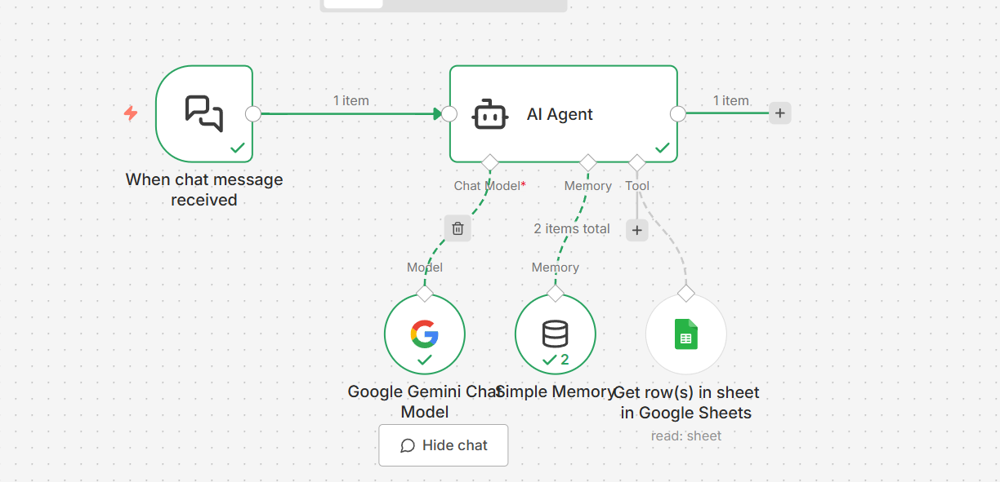
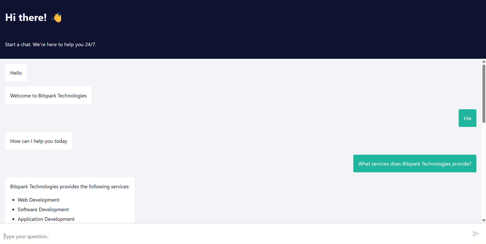
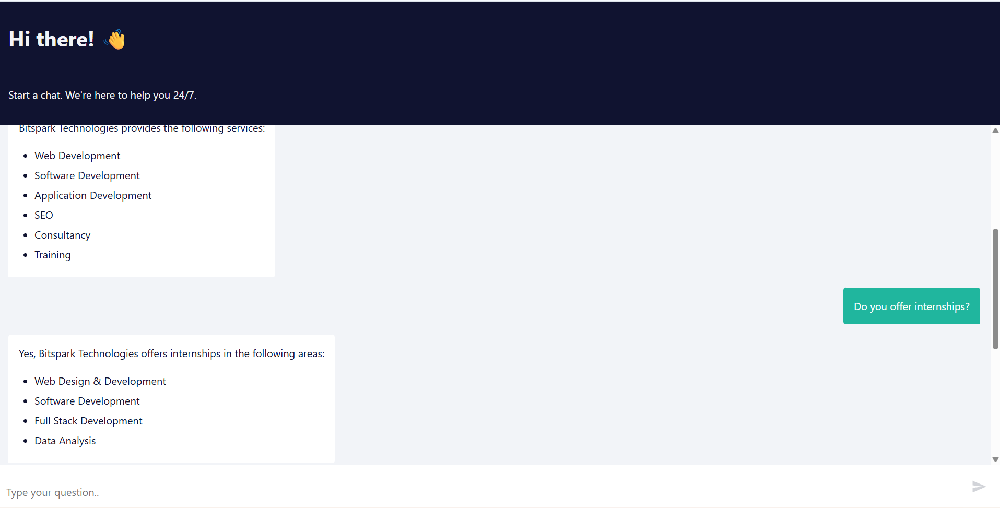

# 🤖 AutoChat Bot using n8n (Bitspark Technologies)

An AI-powered chatbot built using **n8n workflows** that answers queries related to **Bitspark Technologies** using structured company data from Google Sheets.

---

## 🚀 Overview

This project is an automated chatbot system designed to:

* Answer user queries about Bitspark Technologies
* Use structured data from Google Sheets
* Maintain short-term conversational memory
* Provide accurate, controlled responses using AI

---
## 💬 Access the Chatbot

Click the link below to access and start using the AutoChat Bot:

👉 [Open Chatbot] (http://localhost:5678/webhook/92e22c1d-1567-4a7f-ad68-ba2e11980405/chat)

---

## 🧠 Tech Stack

* **n8n** – Workflow automation
* **Google Gemini API** – AI response generation
* **Google Sheets** – Data source
* **Memory Node (5 messages)** – Context handling

---

## ⚙️ Workflow Architecture

```
User Input
   ↓
AI Agent
   ↓
Tool Layer
   ├── Gemini (LLM Response)
   ├── Google Sheets (Company Data)
   └── Memory (Last 5 Messages)
   ↓
Final Response to User

```

---

## 🔄 Workflow Explanation

### 1. AI Agent

* Acts as the brain of the chatbot
* Understands user intent
* Decides which tool to use

### 2. Gemini (LLM)

* Generates natural language responses
* Controlled using strict prompt rules
* Ensensures answers stay within Bitspark data

### 3. Google Sheets Node

* Stores company-related data:

  * Services
  * Internships
  * Technologies
  * Contact details
* AI fetches answers ONLY from this source

### 4. Memory (Last 5 Messages)

* Stores recent conversation context
* Helps in follow-up questions
* Limited to 5 messages to optimize performance

---

## 🔒 Constraints & Rules

* Only answers related to **Bitspark Technologies**
* No assumptions or external knowledge
* Responses are strictly based on Google Sheets data
* Controlled prompt to avoid hallucination

---

## 📂 Project Structure

```
AutoChat-n8n/
│
├── workflow.json        # Exported n8n workflow
├── README.md           # Project documentation
├── Workflow_Images/
│   ├── Workflow.png # Workflow screenshots
|   ├── Chat_Images/
|       ├── Chat_Image_1
|       ├── Chat_Image_1

```

---

## 📸 Screenshots

## 📸 Workflow Preview



## 📸 Chat Images





---

## 🛠️ Setup Instructions

1. Clone the repository:

   ```bash
   git clone https://github.com/your-username/AutoChat-n8n.git
   ```

2. Open n8n:

   * If installed locally → open: `http://localhost:5678`
   * Or use n8n cloud

3. Import workflow:

   * Click **Import**
   * Upload `workflow.json`

4. Configure credentials:

   * Add **Google Sheets API credentials**
   * Add **Google Gemini API key**

5. Connect your Google Sheet:

   * Ensure it contains Bitspark Technologies data
   * Link it to the Google Sheets node

6. Activate the workflow

---

## 💻 How to Access on Your PC

### Option 1: Run n8n Locally (Recommended)

1. Install n8n globally:

   ```bash
   npm install -g n8n
   ```

2. Start n8n:

   ```bash
   n8n
   ```

3. Open in browser:

   ```
   http://localhost:5678
   ```

4. Import the workflow and run it

---

### Option 2: Using n8n Desktop

1. Download n8n desktop app
2. Open the app
3. Import `workflow.json`
4. Configure APIs and run

---

### Option 3: n8n Cloud

1. Go to n8n cloud
2. Create account / login
3. Import workflow
4. Configure credentials
5. Run chatbot

---

## 📈 Use Cases

* Company FAQ chatbot
* Internship query assistant
* Internal knowledge assistant
* Website chatbot integration

---

## ✨ Future Improvements

* Add long-term memory (vector database)
* Integrate with WhatsApp / Telegram
* Add multi-language support
* Build frontend UI

---

## 👩‍💻 Author

**Tejal Pagar**    
AI/ML Enthusiast | Data Science Learner   
📍 India

---

⭐ If you find this repository helpful, feel free to star it!

---

## 📄 License

Open-source for learning and educational use.
